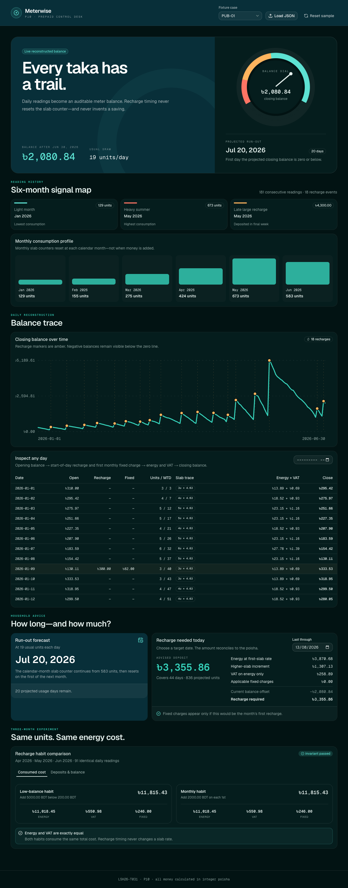

# Meterwise

A solution for **LofiStack Hackathon 2026 — P10: Prepaid Meter Recharge Advisor**.



## Project information

- **Team ID:** `LSH26-T031`
- **Problem:** `P10 — Prepaid Meter Recharge Advisor`
- **Repository:** <https://github.com/Seyamalam/lsh26-t031-p10>
- **Live application:** Pending deployment; the production build is verified locally
- **Demo video:** Not supplied

> Judges should evaluate only the exact 40-character commit SHA entered in the Final Submission Form.

## Solution summary

Meterwise reconstructs a household's prepaid meter balance one day at a time, keeping every recharge, fixed charge, slab allocation, energy cost and VAT amount inspectable. It forecasts the first non-positive balance date, calculates the recharge needed for a chosen target date, and compares two recharge habits while enforcing the clarification that recharge timing cannot create an energy-rate saving.

## Requirement proof

| Requirement | Status | Where to verify |
| --- | --- | --- |
| R1 — At least six months of readings and recharge history, including light/heavy/late-recharge months | Complete | Open the app, change the fixture case, then inspect **Six-month signal map** and **Monthly consumption profile**. `public/data/P10_prepaid_meter_public.json` contains all 25 published cases. |
| R2 — Rebuild balance daily with progressive slabs, first-recharge fixed charges, VAT, chart and markers | Complete | **Balance trace** contains the chart and every daily ledger row. Inspect a slab-crossing or amber recharge row. Pure engine: `src/domain/ledger.ts`; tests: `src/domain/ledger.test.ts` and `src/domain/tariff.test.ts`. |
| R3 — Forecast run-out and calculate the recharge required through a target date with breakdown | Complete | **How long—and how much?** Change **Last through** and inspect the reconciled baseline energy, higher-slab increment, VAT, fixed charges, balance offset and advised deposit. Pure engine/tests: `src/domain/advice.ts` and `src/domain/advice.test.ts`. |
| R4 — Compare low-balance and monthly habits on identical consumption | Complete | **Same units. Same energy cost.** The invariant badge confirms identical energy and VAT. Switch to **Deposits & balance** to see cash added separately from cost. Engine: `src/domain/comparison.ts`; all 25 cases are checked in `src/data/fixture.test.ts`. |

## Judge walkthrough

1. Open the application. It starts on published case `PUB-01`.
2. Select another of the 25 cases from **Fixture case**. Every analysis updates from the same engine.
3. Use **Load JSON** to upload `public/data/P10_prepaid_meter_public.json`, or another P10 JSON document in the published schema. Invalid input shows a readable rejection message.
4. Use **Reset sample** to restore all 25 bundled public cases and `PUB-01`.
5. In **Balance trace**, locate an amber recharge marker and match it to the ledger's recharge and fixed-charge columns. Filter the ledger by month if useful.
6. Change **Last through** to recalculate the target-date recharge advice.
7. In the comparison, confirm the two energy and VAT values match exactly, then switch tabs to separate deposits from meter-consumed cost.

## Calculation decisions

- Money is held as integer poisha. No ledger calculation uses binary floating-point BDT values.
- Daily readings are whole units. A day crossing a boundary is split across every applicable slab.
- Same-day ordering is: opening balance, start-of-day recharge, first-recharge monthly fixed charges, then that day's energy and VAT.
- Demand charge (BDT 42) and meter rent (BDT 40) are taken once, on the first recharge in a calendar month.
- VAT is 5% of energy only and is rounded to the nearest poisha for each daily ledger charge.
- Recharge never resets the monthly unit counter. Only the first calendar day of a month resets it.
- “Runs out on” means the first date whose projected closing balance is zero or below. A balance already at/below zero returns the case's `today` date.
- Recharge advice projects from the end of `today` through the selected target date. A fixed charge is added only if a positive recharge is required and today would be the month's first recharge.
- Habit “cost” is energy + VAT + applicable monthly fixed charges. Deposits and ending balances are displayed separately.

## Run locally

### Requirements

- [Bun](https://bun.sh/) 1.4 or newer
- A modern browser; no database, account, API key or paid service is required

```bash
git clone https://github.com/Seyamalam/lsh26-t031-p10.git
cd lsh26-t031-p10
bun install --frozen-lockfile
bun run dev
```

Open <http://localhost:3000>.

### Verification

```bash
bun run test
bun run typecheck
bun run lint
bun run build
```

The current suite contains 39 tests, including every slab boundary, multi-boundary allocation, monthly reset, first-recharge fixed charge, forecast/advice edge cases, fixture validation and strict energy/VAT equality across all 25 published cases.

## Problem-solving approach

The tariff was implemented first as small, pure domain functions, then reused unchanged by history reconstruction, forecasting, target-date advice and policy comparison. The UI is a judge-facing explanation layer over those outputs: the chart has an auditable daily table, the recharge answer has a reconciled breakdown, and the comparison visibly separates consumed cost from deposited cash. All public cases pass through the same upload validation and calculation path expected for judge-supplied cases.

## Technology

- **Application:** Next.js 16 App Router, React 19, TypeScript
- **Interface:** Tailwind CSS 4 and shadcn components initialized with preset `b0`
- **Testing:** Vitest
- **Data:** Static JSON plus client-side JSON upload; no backend or database
- **Deployment:** Not deployed yet

See [`LICENSES.md`](LICENSES.md) for third-party materials.

## Team contribution

| Registered member | GitHub | Major contribution | Evidence |
| --- | --- | --- | --- |
| Touhidul Alam Seyam | [`Seyamalam`](https://github.com/Seyamalam) | Sole participant: architecture, tariff and ledger engine, fixture support, tests, interface, visual QA and documentation | Repository history and all source files |

## AI usage

OpenAI Codex/ChatGPT assisted with implementation, test generation, interface composition and documentation. The participant verified the work by reviewing the domain rules, running the 39-test suite across all published cases, running TypeScript/ESLint/production builds, and testing desktop and mobile rendering in Chromium. AI output was not accepted as a calculation oracle; invariant and hand-calculated tests provide the evidence.

## Known limitations

- Uploaded cases and chosen filters are intentionally session-only; refreshing restores the bundled public fixture.
- The calculator follows the published whole-unit schema and does not accept fractional daily units.
- VAT rounding is explicitly performed per daily energy charge to the nearest poisha; the problem does not publish an alternative rounding interval.
- There is no live URL until deployment is completed and recorded in this README and `evaluation-manifest.json`.

## Repository records

- [`EVENT.md`](EVENT.md) — event code and empty pre-event-material declaration
- [`evaluation-manifest.json`](evaluation-manifest.json) — structured judging evidence
- [`LICENSES.md`](LICENSES.md) — third-party material and AI disclosure
