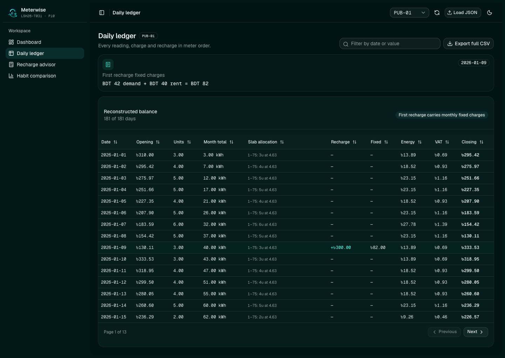
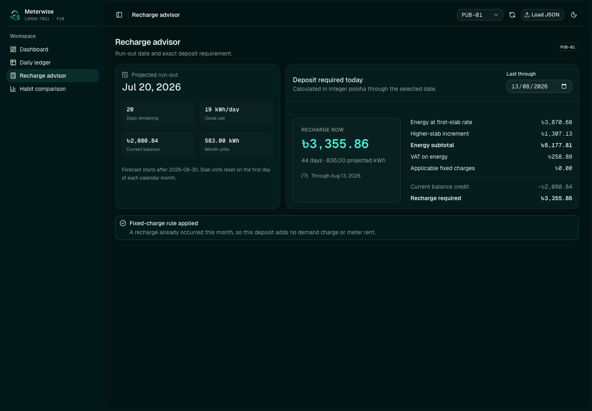
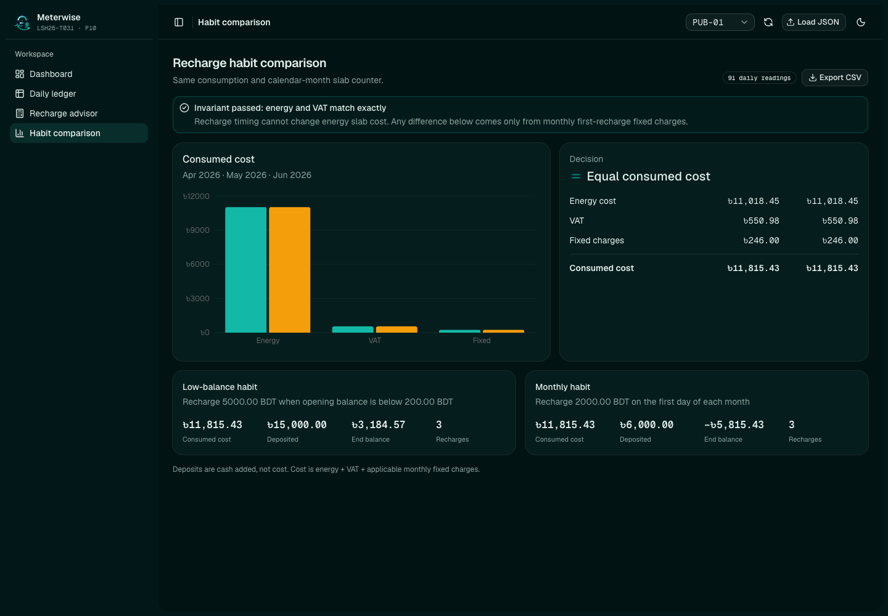
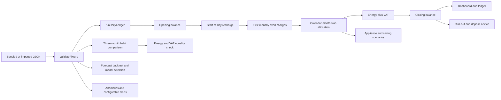

# Meterwise

Meterwise is the LSH26-T031 entry for P10, Prepaid Meter Recharge Advisor.

- Team ID: `LSH26-T031`
- Problem: `P10`
- Repository: <https://github.com/Seyamalam/lsh26-t031-p10>
- Live app: <https://lsh26-t031-p10.vercel.app>
- Demo plan: [`DEMO-60-SECONDS.md`](DEMO-60-SECONDS.md)

Judges should evaluate the exact 40-character commit SHA entered in the final submission form.

## What the app does

Meterwise rebuilds a household meter balance one day at a time. Every recharge, fixed charge, slab allocation, energy cost and VAT amount remains visible in the ledger. The advisor answers when the current balance will run out and how much to deposit for a chosen target date. The comparison route runs both required recharge habits against the same consumption and calendar-month slab counter.

## Requirement proof

| Item                                                                                                 | Route                                                                                                                                    | Screenshot                                                            | Test                                                                                  | Source                                                                                                          |
| ---------------------------------------------------------------------------------------------------- | ---------------------------------------------------------------------------------------------------------------------------------------- | --------------------------------------------------------------------- | ------------------------------------------------------------------------------------- | --------------------------------------------------------------------------------------------------------------- |
| 1. Six months of readings, recharge history, light month, heavy summer month and late large recharge | [`/dashboard`](https://lsh26-t031-p10.vercel.app/dashboard#history-checks)                                                               | [`meterwise-overview.png`](public/screenshots/meterwise-overview.png) | `src/data/fixture.test.ts`                                                            | `public/data/P10_prepaid_meter_public.json`, `src/domain/summary.ts`                                            |
| 2. Daily balance, slab charging, monthly fixed charges, VAT, balance chart and recharge markers      | [`/dashboard`](https://lsh26-t031-p10.vercel.app/dashboard), [`/ledger`](https://lsh26-t031-p10.vercel.app/ledger#fixed-charge-evidence) | [`daily-ledger.png`](public/screenshots/daily-ledger.png)             | `src/domain/ledger.test.ts`, `src/domain/tariff.test.ts`, `src/domain/export.test.ts` | `src/domain/ledger.ts`, `src/domain/tariff.ts`, `components/analysis-charts.tsx`, `components/ledger-table.tsx` |
| 3. Run-out date and target-date deposit with energy, higher-slab, fixed charge and VAT breakdown     | [`/advisor`](https://lsh26-t031-p10.vercel.app/advisor#deposit-breakdown)                                                                | [`recharge-advisor.png`](public/screenshots/recharge-advisor.png)     | `src/domain/advice.test.ts`                                                           | `src/domain/advice.ts`, `components/advisor-view.tsx`                                                           |
| 4. Three-month comparison with identical consumption and no fabricated slab saving                   | [`/comparison`](https://lsh26-t031-p10.vercel.app/comparison#habit-invariant)                                                            | [`habit-comparison.png`](public/screenshots/habit-comparison.png)     | `src/data/fixture.test.ts`, `src/domain/export.test.ts`                               | `src/domain/comparison.ts`, `components/comparison-view.tsx`                                                    |

The dashboard starts with seven judge shortcuts. Each one links to the exact light month, heavy summer month, late recharge, first fixed charge, run-out answer, deposit breakdown or energy and VAT invariant.

## Bonus analysis

| System | Route | Test | Source |
| --- | --- | --- | --- |
| Evaluated 30-day demand forecast with automatic model selection and RMSE uncertainty band | [`/forecast`](https://lsh26-t031-p10.vercel.app/forecast) | `src/domain/forecast.test.ts` | `src/domain/forecast.ts`, `components/forecast-view.tsx` |
| Explainable consumption anomalies and configurable budget and run-out alerts | [`/alerts`](https://lsh26-t031-p10.vercel.app/alerts) | `src/domain/insights.test.ts` | `src/domain/insights.ts`, `components/alerts-view.tsx` |
| Slab-aware appliance cost and 5, 10 and 20 percent saving scenarios | [`/simulator`](https://lsh26-t031-p10.vercel.app/simulator) | `src/domain/appliance.test.ts` | `src/domain/appliance.ts`, `components/simulator-view.tsx` |

The forecast trains a regularized linear regression on trend, weekday seasonality, lagged readings and a trailing mean. A 30-day holdout compares it with a 7-day mean baseline. The route selects the lower-RMSE result and shows prediction plus or minus 1.645 times holdout RMSE as an uncertainty guide, not a calibrated probability interval. All analysis runs in TypeScript in the browser.

## Screenshots

| Dashboard and judge shortcuts                                                                                         | Daily ledger and CSV export                                                                               |
| --------------------------------------------------------------------------------------------------------------------- | --------------------------------------------------------------------------------------------------------- |
|  |  |
| Recharge advisor                                                                                                      | Habit comparison                                                                                          |
|                   |           |

## Calculation flow



The engine stores money as integer poisha. A day that crosses a slab boundary is split across each applicable slab. Recharging does not reset the monthly unit counter.

## Judge walkthrough

1. Open `/dashboard`. Use the judge shortcuts to inspect the three required history cases.
2. Open `/ledger#fixed-charge-evidence`. The first charged recharge shows BDT 42 demand charge plus BDT 40 meter rent. Sort or filter the table, then use `Export full CSV` to download every ledger row.
3. Open `/advisor`. Change `Last through` and reconcile the deposit against the visible energy, higher-slab, VAT, fixed charge and balance-credit lines.
4. Open `/comparison`. Confirm that energy and VAT match exactly. The screen keeps consumed cost separate from deposits. `Export CSV` downloads both policy summaries.
5. Use `Load JSON` to try an import, then use reset to restore the 25 bundled cases.

## Importing JSON

Imports are parsed in the browser and are never sent to a server.

1. Click `Load JSON` in the header.
2. Choose [`public/data/P10_import_example.json`](public/data/P10_import_example.json) to check the accepted shape.
3. The selected case and every route update from the imported data.
4. Click the reset button to return to [`public/data/P10_prepaid_meter_public.json`](public/data/P10_prepaid_meter_public.json), which contains the full 25-case judging fixture.

Each document needs `schema_version`, `problem_id: "P10"` and a non-empty `cases` array. Each case needs an ID, opening balance, ascending whole-unit readings, recharge history, `today`, usual daily use, target date and a comparison object naming exactly three months. Invalid files produce a visible error and do not replace the current data.

The 90-day import example demonstrates the file shape and is long enough for the 30-day forecast holdout. It is not a replacement for the full six-month public fixture used for requirement proof.

## Calculation decisions

- Money is held as integer poisha. Ledger calculations never use binary floating-point BDT values.
- Daily readings are whole units. A day can allocate units across several slabs.
- The daily order is opening balance, recharge, first monthly fixed charges, energy, VAT and closing balance.
- Demand charge is BDT 42 and meter rent is BDT 40. Both are taken once on the first recharge in a calendar month.
- VAT is 5 percent of energy and is rounded to the nearest poisha for each daily charge.
- The monthly slab counter resets only on the first calendar day of a month.
- "Runs out on" means the first date whose projected closing balance is zero or below.
- Recharge advice starts after `today` and includes a fixed charge only when a positive deposit is needed and today would be the month's first recharge.
- Habit cost means energy, VAT and applicable monthly fixed charges. Deposits and ending balances are reported separately.

## Run locally

You need Bun 1.4 or newer and a modern browser. The app has no database, account, API key or paid service.

```bash
git clone https://github.com/Seyamalam/lsh26-t031-p10.git
cd lsh26-t031-p10
bun install --frozen-lockfile
bun run dev
```

Open <http://localhost:3000>.

Run the same checks used for the submission:

```bash
bun run test
bun run typecheck
bun run lint
bun run build
```

The suite has 71 tests. It covers slab boundaries, multi-boundary allocation, monthly reset, first-recharge fixed charges, forecast backtesting, anomaly explanations, budget alerts, appliance scenarios, deposit advice, CSV output, hardened fixture validation, upload retry state and strict energy and VAT equality across all 25 published cases.

## Technology

- Next.js 16 App Router, React 19 and TypeScript
- Tailwind CSS 4, shadcn preset `b0` and the beUI file upload block
- TanStack React Table and Recharts through shadcn Chart
- Vitest
- Vercel deployment

See [`LICENSES.md`](LICENSES.md) for license details.

## Team contribution

| Registered member   | GitHub                                      | Contribution                                                                                                                             |
| ------------------- | ------------------------------------------- | ---------------------------------------------------------------------------------------------------------------------------------------- |
| Touhidul Alam Seyam | [`Seyamalam`](https://github.com/Seyamalam) | Sole implementation owner for architecture, tariff and ledger code, fixture handling, tests, interface, browser checks and documentation |
| Pratik Dev          | Not provided                                | Unable to participate in the build due to a severe health crisis                                                                         |

## AI use

OpenAI Codex/ChatGPT and OpenCode assisted with implementation, tests, interface work and documentation. OpenAI image generation produced the disclosed Meterwise mark and favicon. Touhidul Alam Seyam reviewed the calculation rules, checked hand-calculated cases, ran the full automated suite and completed TypeScript, ESLint, production build and browser checks. AI output was not treated as a calculation oracle.

## Known limitations

- Imported fixtures, the selected case and table filters last only for the current browser session. A refresh restores the bundled fixture. Theme preference persists.
- The published schema uses whole-unit readings, so the importer rejects fractional daily units.
- VAT is rounded per daily energy charge to the nearest poisha because the problem does not specify another rounding interval.

## Repository records

- [`EVENT.md`](EVENT.md) records the event code and pre-event material declaration.
- [`evaluation-manifest.json`](evaluation-manifest.json) maps claims to routes, screenshots, tests and source files.
- [`LICENSES.md`](LICENSES.md) lists third-party material and AI use.
- [`DEMO-60-SECONDS.md`](DEMO-60-SECONDS.md) contains the one-minute recording script.
